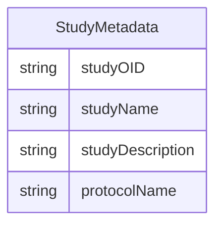

# Class: StudyMetadata 


_A mixin that provides study-level metadata attributes including study identification and protocol information_


URI: [odm:class/StudyMetadata](https://cdisc.org/odm2/class/StudyMetadata)





<!-- no inheritance hierarchy -->


## Slots

| Name | Cardinality and Range | Description | Inheritance |
| ---  | --- | --- | --- |
| [studyOID](../slots/studyOID.md) | 1 <br/> [String](../types/String.md) | Unique identifier for the study | direct |
| [studyName](../slots/studyName.md) | 0..1 <br/> [String](../types/String.md) | Name of the study | direct |
| [studyDescription](../slots/studyDescription.md) | 0..1 <br/> [String](../types/String.md) | Description of the study | direct |
| [protocolName](../slots/protocolName.md) | 0..1 <br/> [String](../types/String.md) | Protocol name for the study | direct |


## Mixin Usage

| mixed into | description |
| --- | --- |
| [MetaDataVersion](../classes/MetaDataVersion.md) | A container element that represents a given version of a specification, linki... |


## Identifier and Mapping Information


### Schema Source


* from schema: https://cdisc.org/define-json


## Mappings

| Mapping Type | Mapped Value |
| ---  | ---  |
| self | odm:StudyMetadata |
| native | odm:StudyMetadata |


## LinkML Source

<!-- TODO: investigate https://stackoverflow.com/questions/37606292/how-to-create-tabbed-code-blocks-in-mkdocs-or-sphinx -->

### Direct

<details>
```yaml
name: StudyMetadata
description: A mixin that provides study-level metadata attributes including study
  identification and protocol information
from_schema: https://cdisc.org/define-json
mixin: true
attributes:
  studyOID:
    name: studyOID
    description: Unique identifier for the study
    from_schema: https://cdisc.org/define-json
    rank: 1000
    domain_of:
    - StudyMetadata
    range: string
    required: true
  studyName:
    name: studyName
    description: Name of the study
    from_schema: https://cdisc.org/define-json
    rank: 1000
    domain_of:
    - StudyMetadata
    range: string
  studyDescription:
    name: studyDescription
    description: Description of the study
    from_schema: https://cdisc.org/define-json
    rank: 1000
    domain_of:
    - StudyMetadata
    range: string
  protocolName:
    name: protocolName
    description: Protocol name for the study
    from_schema: https://cdisc.org/define-json
    rank: 1000
    domain_of:
    - StudyMetadata
    range: string

```
</details>

### Induced

<details>
```yaml
name: StudyMetadata
description: A mixin that provides study-level metadata attributes including study
  identification and protocol information
from_schema: https://cdisc.org/define-json
mixin: true
attributes:
  studyOID:
    name: studyOID
    description: Unique identifier for the study
    from_schema: https://cdisc.org/define-json
    rank: 1000
    alias: studyOID
    owner: StudyMetadata
    domain_of:
    - StudyMetadata
    range: string
    required: true
  studyName:
    name: studyName
    description: Name of the study
    from_schema: https://cdisc.org/define-json
    rank: 1000
    alias: studyName
    owner: StudyMetadata
    domain_of:
    - StudyMetadata
    range: string
  studyDescription:
    name: studyDescription
    description: Description of the study
    from_schema: https://cdisc.org/define-json
    rank: 1000
    alias: studyDescription
    owner: StudyMetadata
    domain_of:
    - StudyMetadata
    range: string
  protocolName:
    name: protocolName
    description: Protocol name for the study
    from_schema: https://cdisc.org/define-json
    rank: 1000
    alias: protocolName
    owner: StudyMetadata
    domain_of:
    - StudyMetadata
    range: string

```
</details>