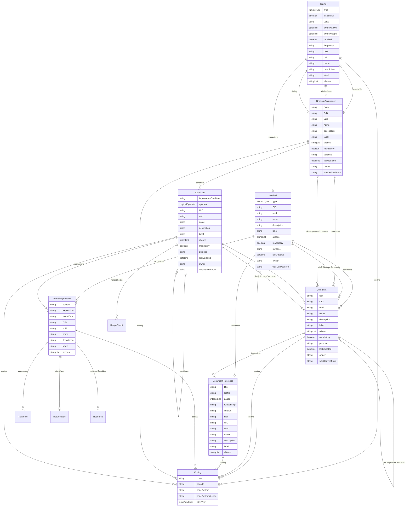

# Class: Timing 


_A temporal element that describes the timing of an event or occurrence, which can be absolute, relative, or nominal_


URI: [odm:class/Timing](https://cdisc.org/odm2/class/Timing)





## Inheritance
* [IdentifiableElement](../classes/IdentifiableElement.md) [ [Identifiable](../classes/Identifiable.md) [Labelled](../classes/Labelled.md)]
    * **Timing**


## Slots

| Name | Cardinality and Range | Description | Inheritance |
| ---  | --- | --- | --- |
| [type](../slots/type.md) | 1 <br/> [TimingType](../enums/TimingType.md) | The type of timing: Fixed, Before (Relative), or After (Relative). | direct |
| [isNominal](../slots/isNominal.md) | 0..1 <br/> [Boolean](../types/Boolean.md) | Indicates whether the timing is nominal (event-based) or not. | direct |
| [value](../slots/value.md) | 1 <br/> [String](../types/String.md) | The value of the timing, which can be a date/time, duration, or event reference. | direct |
| [relativeTo](../slots/relativeTo.md) | 0..1 <br/> [NominalOccurrence](../classes/NominalOccurrence.md) | Reference to the event or occurrence that this timing is relative to. | direct |
| [relativeFrom](../slots/relativeFrom.md) | 0..1 <br/> [NominalOccurrence](../classes/NominalOccurrence.md) | Reference to the event or occurrence that this timing is relative to. | direct |
| [windowLower](../slots/windowLower.md) | 0..1 <br/> [Datetime](../types/Datetime.md) | Start date/time of the timing | direct |
| [windowUpper](../slots/windowUpper.md) | 0..1 <br/> [Datetime](../types/Datetime.md) | End date/time of the timing | direct |
| [recalled](../slots/recalled.md) | 0..1 <br/> [Boolean](../types/Boolean.md) | Indicates whether the timing is recalled or not (recalled timings are less reliable). | direct |
| [frequency](../slots/frequency.md) | 0..1 <br/> [String](../types/String.md) | Frequency. Use dose frequency terminology e.g. "BID" if applicable. | direct |
| [imputation](../slots/imputation.md) | 0..1 <br/> [Method](../classes/Method.md) | The imputation method used for the Timing. | direct |
| [OID](../slots/OID.md) | 1 <br/> [String](../types/String.md) | Local identifier within this study/context. Use CDISC OID format for regulatory submissions, or simple strings for internal use. | [Identifiable](../classes/Identifiable.md) |
| [uuid](../slots/uuid.md) | 0..1 <br/> [String](../types/String.md) | Universal unique identifier | [Identifiable](../classes/Identifiable.md) |
| [name](../slots/name.md) | 0..1 <br/> [String](../types/String.md) | Short name or identifier, used for field names | [Labelled](../classes/Labelled.md) |
| [description](../slots/description.md) | 0..1 <br/> [String](../types/String.md)&nbsp;or&nbsp;<br />[String](../types/String.md)&nbsp;or&nbsp;<br />[TranslatedText](../classes/TranslatedText.md) | Detailed description, shown in tooltips | [Labelled](../classes/Labelled.md) |
| [coding](../slots/coding.md) | * <br/> [Coding](../classes/Coding.md) | Semantic tags for this element | [Labelled](../classes/Labelled.md) |
| [label](../slots/label.md) | 0..1 <br/> [String](../types/String.md)&nbsp;or&nbsp;<br />[String](../types/String.md)&nbsp;or&nbsp;<br />[TranslatedText](../classes/TranslatedText.md) | Human-readable label, shown in UIs | [Labelled](../classes/Labelled.md) |
| [aliases](../slots/aliases.md) | * <br/> [String](../types/String.md)&nbsp;or&nbsp;<br />[String](../types/String.md)&nbsp;or&nbsp;<br />[TranslatedText](../classes/TranslatedText.md) | Alternative name or identifier | [Labelled](../classes/Labelled.md) |


## Usages

| used by | used in | type | used |
| ---  | --- | --- | --- |
| [IsProfile](../classes/IsProfile.md) | [validityPeriod](../slots/validityPeriod.md) | range | [Timing](../classes/Timing.md) |
| [ItemGroup](../classes/ItemGroup.md) | [validityPeriod](../slots/validityPeriod.md) | range | [Timing](../classes/Timing.md) |
| [NominalOccurrence](../classes/NominalOccurrence.md) | [timing](../slots/timing.md) | range | [Timing](../classes/Timing.md) |
| [DataStructureDefinition](../classes/DataStructureDefinition.md) | [validityPeriod](../slots/validityPeriod.md) | range | [Timing](../classes/Timing.md) |
| [Dataset](../classes/Dataset.md) | [validityPeriod](../slots/validityPeriod.md) | range | [Timing](../classes/Timing.md) |


## Identifier and Mapping Information


### Schema Source


* from schema: https://cdisc.org/define-json


## Mappings

| Mapping Type | Mapped Value |
| ---  | ---  |
| self | odm:Timing |
| native | odm:Timing |
| exact | usdm:Timing |
| narrow | omop:Observation_period, omop:Drug_era, omop:Condition_era, omop:Procedure_era, fhir:Period, fhir:Age, fhir:Duration |
| broad | fhir:Timing |


## LinkML Source

<!-- TODO: investigate https://stackoverflow.com/questions/37606292/how-to-create-tabbed-code-blocks-in-mkdocs-or-sphinx -->

### Direct

<details>
```yaml
name: Timing
description: A temporal element that describes the timing of an event or occurrence,
  which can be absolute, relative, or nominal
from_schema: https://cdisc.org/define-json
exact_mappings:
- usdm:Timing
narrow_mappings:
- omop:Observation_period
- omop:Drug_era
- omop:Condition_era
- omop:Procedure_era
- fhir:Period
- fhir:Age
- fhir:Duration
broad_mappings:
- fhir:Timing
is_a: IdentifiableElement
attributes:
  type:
    name: type
    description: 'The type of timing: Fixed, Before (Relative), or After (Relative).'
    from_schema: https://cdisc.org/define-json
    domain_of:
    - ItemGroup
    - Method
    - Origin
    - Organization
    - Standard
    - Timing
    range: TimingType
    required: true
  isNominal:
    name: isNominal
    description: Indicates whether the timing is nominal (event-based) or not.
    from_schema: https://cdisc.org/define-json
    rank: 1000
    domain_of:
    - Timing
    range: boolean
  value:
    name: value
    description: The value of the timing, which can be a date/time, duration, or event
      reference.
    from_schema: https://cdisc.org/define-json
    domain_of:
    - Translation
    - Parameter
    - Timing
    range: string
    required: true
  relativeTo:
    name: relativeTo
    description: Reference to the event or occurrence that this timing is relative
      to.
    from_schema: https://cdisc.org/define-json
    rank: 1000
    domain_of:
    - Timing
    range: NominalOccurrence
  relativeFrom:
    name: relativeFrom
    description: Reference to the event or occurrence that this timing is relative
      to.
    from_schema: https://cdisc.org/define-json
    rank: 1000
    domain_of:
    - Timing
    range: NominalOccurrence
  windowLower:
    name: windowLower
    description: Start date/time of the timing
    from_schema: https://cdisc.org/define-json
    rank: 1000
    domain_of:
    - Timing
    range: datetime
  windowUpper:
    name: windowUpper
    description: End date/time of the timing
    from_schema: https://cdisc.org/define-json
    rank: 1000
    domain_of:
    - Timing
    range: datetime
  recalled:
    name: recalled
    description: Indicates whether the timing is recalled or not (recalled timings
      are less reliable).
    from_schema: https://cdisc.org/define-json
    rank: 1000
    domain_of:
    - Timing
    range: boolean
  frequency:
    name: frequency
    description: Frequency. Use dose frequency terminology e.g. "BID" if applicable.
    from_schema: https://cdisc.org/define-json
    rank: 1000
    domain_of:
    - Timing
    range: string
  imputation:
    name: imputation
    description: The imputation method used for the Timing.
    from_schema: https://cdisc.org/define-json
    rank: 1000
    domain_of:
    - Timing
    - CubeComponent
    range: Method

```
</details>

### Induced

<details>
```yaml
name: Timing
description: A temporal element that describes the timing of an event or occurrence,
  which can be absolute, relative, or nominal
from_schema: https://cdisc.org/define-json
exact_mappings:
- usdm:Timing
narrow_mappings:
- omop:Observation_period
- omop:Drug_era
- omop:Condition_era
- omop:Procedure_era
- fhir:Period
- fhir:Age
- fhir:Duration
broad_mappings:
- fhir:Timing
is_a: IdentifiableElement
attributes:
  type:
    name: type
    description: 'The type of timing: Fixed, Before (Relative), or After (Relative).'
    from_schema: https://cdisc.org/define-json
    alias: type
    owner: Timing
    domain_of:
    - ItemGroup
    - Method
    - Origin
    - Organization
    - Standard
    - Timing
    range: TimingType
    required: true
  isNominal:
    name: isNominal
    description: Indicates whether the timing is nominal (event-based) or not.
    from_schema: https://cdisc.org/define-json
    rank: 1000
    alias: isNominal
    owner: Timing
    domain_of:
    - Timing
    range: boolean
  value:
    name: value
    description: The value of the timing, which can be a date/time, duration, or event
      reference.
    from_schema: https://cdisc.org/define-json
    alias: value
    owner: Timing
    domain_of:
    - Translation
    - Parameter
    - Timing
    range: string
    required: true
  relativeTo:
    name: relativeTo
    description: Reference to the event or occurrence that this timing is relative
      to.
    from_schema: https://cdisc.org/define-json
    rank: 1000
    alias: relativeTo
    owner: Timing
    domain_of:
    - Timing
    range: NominalOccurrence
  relativeFrom:
    name: relativeFrom
    description: Reference to the event or occurrence that this timing is relative
      to.
    from_schema: https://cdisc.org/define-json
    rank: 1000
    alias: relativeFrom
    owner: Timing
    domain_of:
    - Timing
    range: NominalOccurrence
  windowLower:
    name: windowLower
    description: Start date/time of the timing
    from_schema: https://cdisc.org/define-json
    rank: 1000
    alias: windowLower
    owner: Timing
    domain_of:
    - Timing
    range: datetime
  windowUpper:
    name: windowUpper
    description: End date/time of the timing
    from_schema: https://cdisc.org/define-json
    rank: 1000
    alias: windowUpper
    owner: Timing
    domain_of:
    - Timing
    range: datetime
  recalled:
    name: recalled
    description: Indicates whether the timing is recalled or not (recalled timings
      are less reliable).
    from_schema: https://cdisc.org/define-json
    rank: 1000
    alias: recalled
    owner: Timing
    domain_of:
    - Timing
    range: boolean
  frequency:
    name: frequency
    description: Frequency. Use dose frequency terminology e.g. "BID" if applicable.
    from_schema: https://cdisc.org/define-json
    rank: 1000
    alias: frequency
    owner: Timing
    domain_of:
    - Timing
    range: string
  imputation:
    name: imputation
    description: The imputation method used for the Timing.
    from_schema: https://cdisc.org/define-json
    rank: 1000
    alias: imputation
    owner: Timing
    domain_of:
    - Timing
    - CubeComponent
    range: Method
  OID:
    name: OID
    description: Local identifier within this study/context. Use CDISC OID format
      for regulatory submissions, or simple strings for internal use.
    from_schema: https://cdisc.org/define-json
    rank: 1000
    identifier: true
    alias: OID
    owner: Timing
    domain_of:
    - Identifiable
    range: string
    required: true
    pattern: ^[A-Za-z][A-Za-z0-9._-]*$
  uuid:
    name: uuid
    description: Universal unique identifier
    from_schema: https://cdisc.org/define-json
    rank: 1000
    alias: uuid
    owner: Timing
    domain_of:
    - Identifiable
    range: string
  name:
    name: name
    description: Short name or identifier, used for field names
    from_schema: https://cdisc.org/define-json
    rank: 1000
    alias: name
    owner: Timing
    domain_of:
    - Labelled
    - Standard
    range: string
  description:
    name: description
    description: Detailed description, shown in tooltips
    from_schema: https://cdisc.org/define-json
    rank: 1000
    alias: description
    owner: Timing
    domain_of:
    - Labelled
    - CodeListItem
    range: string
    any_of:
    - range: string
    - range: TranslatedText
  coding:
    name: coding
    description: Semantic tags for this element
    from_schema: https://cdisc.org/define-json
    rank: 1000
    alias: coding
    owner: Timing
    domain_of:
    - Labelled
    - CodeListItem
    - SourceItem
    range: Coding
    multivalued: true
    inlined: true
    inlined_as_list: true
  label:
    name: label
    description: Human-readable label, shown in UIs
    from_schema: https://cdisc.org/define-json
    exact_mappings:
    - skos:prefLabel
    rank: 1000
    alias: label
    owner: Timing
    domain_of:
    - Labelled
    range: string
    any_of:
    - range: string
    - range: TranslatedText
  aliases:
    name: aliases
    description: Alternative name or identifier
    from_schema: https://cdisc.org/define-json
    exact_mappings:
    - skos:altLabel
    rank: 1000
    alias: aliases
    owner: Timing
    domain_of:
    - Labelled
    - CodeListItem
    range: string
    multivalued: true
    inlined: true
    inlined_as_list: true
    any_of:
    - range: string
    - range: TranslatedText

```
</details>