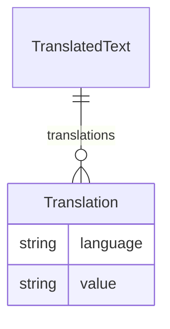

# Class: TranslatedText 


URI: [odm:class/TranslatedText](https://cdisc.org/odm2/class/TranslatedText)





<!-- no inheritance hierarchy -->


## Slots

| Name | Cardinality and Range | Description | Inheritance |
| ---  | --- | --- | --- |
| [translations](../slots/translations.md) | * <br/> [Translation](../classes/Translation.md) |  | direct |


## Usages

| used by | used in | type | used |
| ---  | --- | --- | --- |
| [IdentifiableElement](../classes/IdentifiableElement.md) | [description](../slots/description.md) | any_of[range] | [TranslatedText](../classes/TranslatedText.md) |
| [IdentifiableElement](../classes/IdentifiableElement.md) | [label](../slots/label.md) | any_of[range] | [TranslatedText](../classes/TranslatedText.md) |
| [IdentifiableElement](../classes/IdentifiableElement.md) | [aliases](../slots/aliases.md) | any_of[range] | [TranslatedText](../classes/TranslatedText.md) |
| [GovernedElement](../classes/GovernedElement.md) | [description](../slots/description.md) | any_of[range] | [TranslatedText](../classes/TranslatedText.md) |
| [GovernedElement](../classes/GovernedElement.md) | [label](../slots/label.md) | any_of[range] | [TranslatedText](../classes/TranslatedText.md) |
| [GovernedElement](../classes/GovernedElement.md) | [aliases](../slots/aliases.md) | any_of[range] | [TranslatedText](../classes/TranslatedText.md) |
| [GovernedElement](../classes/GovernedElement.md) | [purpose](../slots/purpose.md) | any_of[range] | [TranslatedText](../classes/TranslatedText.md) |
| [Governed](../classes/Governed.md) | [purpose](../slots/purpose.md) | any_of[range] | [TranslatedText](../classes/TranslatedText.md) |
| [Labelled](../classes/Labelled.md) | [description](../slots/description.md) | any_of[range] | [TranslatedText](../classes/TranslatedText.md) |
| [Labelled](../classes/Labelled.md) | [label](../slots/label.md) | any_of[range] | [TranslatedText](../classes/TranslatedText.md) |
| [Labelled](../classes/Labelled.md) | [aliases](../slots/aliases.md) | any_of[range] | [TranslatedText](../classes/TranslatedText.md) |
| [IsODMItem](../classes/IsODMItem.md) | [role](../slots/role.md) | any_of[range] | [TranslatedText](../classes/TranslatedText.md) |
| [IsODMItem](../classes/IsODMItem.md) | [crfCompletionInstructions](../slots/crfCompletionInstructions.md) | any_of[range] | [TranslatedText](../classes/TranslatedText.md) |
| [IsODMItem](../classes/IsODMItem.md) | [cdiscNotes](../slots/cdiscNotes.md) | any_of[range] | [TranslatedText](../classes/TranslatedText.md) |
| [IsODMItem](../classes/IsODMItem.md) | [implementationNotes](../slots/implementationNotes.md) | any_of[range] | [TranslatedText](../classes/TranslatedText.md) |
| [IsODMItem](../classes/IsODMItem.md) | [preSpecifiedValue](../slots/preSpecifiedValue.md) | any_of[range] | [TranslatedText](../classes/TranslatedText.md) |
| [MetaDataVersion](../classes/MetaDataVersion.md) | [description](../slots/description.md) | any_of[range] | [TranslatedText](../classes/TranslatedText.md) |
| [MetaDataVersion](../classes/MetaDataVersion.md) | [label](../slots/label.md) | any_of[range] | [TranslatedText](../classes/TranslatedText.md) |
| [MetaDataVersion](../classes/MetaDataVersion.md) | [aliases](../slots/aliases.md) | any_of[range] | [TranslatedText](../classes/TranslatedText.md) |
| [MetaDataVersion](../classes/MetaDataVersion.md) | [purpose](../slots/purpose.md) | any_of[range] | [TranslatedText](../classes/TranslatedText.md) |
| [Item](../classes/Item.md) | [role](../slots/role.md) | any_of[range] | [TranslatedText](../classes/TranslatedText.md) |
| [Item](../classes/Item.md) | [crfCompletionInstructions](../slots/crfCompletionInstructions.md) | any_of[range] | [TranslatedText](../classes/TranslatedText.md) |
| [Item](../classes/Item.md) | [cdiscNotes](../slots/cdiscNotes.md) | any_of[range] | [TranslatedText](../classes/TranslatedText.md) |
| [Item](../classes/Item.md) | [implementationNotes](../slots/implementationNotes.md) | any_of[range] | [TranslatedText](../classes/TranslatedText.md) |
| [Item](../classes/Item.md) | [preSpecifiedValue](../slots/preSpecifiedValue.md) | any_of[range] | [TranslatedText](../classes/TranslatedText.md) |
| [Item](../classes/Item.md) | [description](../slots/description.md) | any_of[range] | [TranslatedText](../classes/TranslatedText.md) |
| [Item](../classes/Item.md) | [label](../slots/label.md) | any_of[range] | [TranslatedText](../classes/TranslatedText.md) |
| [Item](../classes/Item.md) | [aliases](../slots/aliases.md) | any_of[range] | [TranslatedText](../classes/TranslatedText.md) |
| [Item](../classes/Item.md) | [purpose](../slots/purpose.md) | any_of[range] | [TranslatedText](../classes/TranslatedText.md) |
| [ItemGroup](../classes/ItemGroup.md) | [structure](../slots/structure.md) | any_of[range] | [TranslatedText](../classes/TranslatedText.md) |
| [ItemGroup](../classes/ItemGroup.md) | [description](../slots/description.md) | any_of[range] | [TranslatedText](../classes/TranslatedText.md) |
| [ItemGroup](../classes/ItemGroup.md) | [label](../slots/label.md) | any_of[range] | [TranslatedText](../classes/TranslatedText.md) |
| [ItemGroup](../classes/ItemGroup.md) | [aliases](../slots/aliases.md) | any_of[range] | [TranslatedText](../classes/TranslatedText.md) |
| [ItemGroup](../classes/ItemGroup.md) | [purpose](../slots/purpose.md) | any_of[range] | [TranslatedText](../classes/TranslatedText.md) |
| [Relationship](../classes/Relationship.md) | [description](../slots/description.md) | any_of[range] | [TranslatedText](../classes/TranslatedText.md) |
| [Relationship](../classes/Relationship.md) | [label](../slots/label.md) | any_of[range] | [TranslatedText](../classes/TranslatedText.md) |
| [Relationship](../classes/Relationship.md) | [aliases](../slots/aliases.md) | any_of[range] | [TranslatedText](../classes/TranslatedText.md) |
| [CodeList](../classes/CodeList.md) | [description](../slots/description.md) | any_of[range] | [TranslatedText](../classes/TranslatedText.md) |
| [CodeList](../classes/CodeList.md) | [label](../slots/label.md) | any_of[range] | [TranslatedText](../classes/TranslatedText.md) |
| [CodeList](../classes/CodeList.md) | [aliases](../slots/aliases.md) | any_of[range] | [TranslatedText](../classes/TranslatedText.md) |
| [CodeList](../classes/CodeList.md) | [purpose](../slots/purpose.md) | any_of[range] | [TranslatedText](../classes/TranslatedText.md) |
| [CodeListItem](../classes/CodeListItem.md) | [description](../slots/description.md) | any_of[range] | [TranslatedText](../classes/TranslatedText.md) |
| [CodeListItem](../classes/CodeListItem.md) | [aliases](../slots/aliases.md) | any_of[range] | [TranslatedText](../classes/TranslatedText.md) |
| [Comment](../classes/Comment.md) | [text](../slots/text.md) | any_of[range] | [TranslatedText](../classes/TranslatedText.md) |
| [Comment](../classes/Comment.md) | [description](../slots/description.md) | any_of[range] | [TranslatedText](../classes/TranslatedText.md) |
| [Comment](../classes/Comment.md) | [label](../slots/label.md) | any_of[range] | [TranslatedText](../classes/TranslatedText.md) |
| [Comment](../classes/Comment.md) | [aliases](../slots/aliases.md) | any_of[range] | [TranslatedText](../classes/TranslatedText.md) |
| [Comment](../classes/Comment.md) | [purpose](../slots/purpose.md) | any_of[range] | [TranslatedText](../classes/TranslatedText.md) |
| [Coding](../classes/Coding.md) | [decode](../slots/decode.md) | any_of[range] | [TranslatedText](../classes/TranslatedText.md) |
| [Dictionary](../classes/Dictionary.md) | [description](../slots/description.md) | any_of[range] | [TranslatedText](../classes/TranslatedText.md) |
| [Dictionary](../classes/Dictionary.md) | [label](../slots/label.md) | any_of[range] | [TranslatedText](../classes/TranslatedText.md) |
| [Dictionary](../classes/Dictionary.md) | [aliases](../slots/aliases.md) | any_of[range] | [TranslatedText](../classes/TranslatedText.md) |
| [ReifiedConcept](../classes/ReifiedConcept.md) | [description](../slots/description.md) | any_of[range] | [TranslatedText](../classes/TranslatedText.md) |
| [ReifiedConcept](../classes/ReifiedConcept.md) | [label](../slots/label.md) | any_of[range] | [TranslatedText](../classes/TranslatedText.md) |
| [ReifiedConcept](../classes/ReifiedConcept.md) | [aliases](../slots/aliases.md) | any_of[range] | [TranslatedText](../classes/TranslatedText.md) |
| [ReifiedConcept](../classes/ReifiedConcept.md) | [purpose](../slots/purpose.md) | any_of[range] | [TranslatedText](../classes/TranslatedText.md) |
| [ConceptProperty](../classes/ConceptProperty.md) | [description](../slots/description.md) | any_of[range] | [TranslatedText](../classes/TranslatedText.md) |
| [ConceptProperty](../classes/ConceptProperty.md) | [label](../slots/label.md) | any_of[range] | [TranslatedText](../classes/TranslatedText.md) |
| [ConceptProperty](../classes/ConceptProperty.md) | [aliases](../slots/aliases.md) | any_of[range] | [TranslatedText](../classes/TranslatedText.md) |
| [ConceptProperty](../classes/ConceptProperty.md) | [purpose](../slots/purpose.md) | any_of[range] | [TranslatedText](../classes/TranslatedText.md) |
| [WhereClause](../classes/WhereClause.md) | [description](../slots/description.md) | any_of[range] | [TranslatedText](../classes/TranslatedText.md) |
| [WhereClause](../classes/WhereClause.md) | [label](../slots/label.md) | any_of[range] | [TranslatedText](../classes/TranslatedText.md) |
| [WhereClause](../classes/WhereClause.md) | [aliases](../slots/aliases.md) | any_of[range] | [TranslatedText](../classes/TranslatedText.md) |
| [WhereClause](../classes/WhereClause.md) | [purpose](../slots/purpose.md) | any_of[range] | [TranslatedText](../classes/TranslatedText.md) |
| [Condition](../classes/Condition.md) | [description](../slots/description.md) | any_of[range] | [TranslatedText](../classes/TranslatedText.md) |
| [Condition](../classes/Condition.md) | [label](../slots/label.md) | any_of[range] | [TranslatedText](../classes/TranslatedText.md) |
| [Condition](../classes/Condition.md) | [aliases](../slots/aliases.md) | any_of[range] | [TranslatedText](../classes/TranslatedText.md) |
| [Condition](../classes/Condition.md) | [purpose](../slots/purpose.md) | any_of[range] | [TranslatedText](../classes/TranslatedText.md) |
| [FormalExpression](../classes/FormalExpression.md) | [description](../slots/description.md) | any_of[range] | [TranslatedText](../classes/TranslatedText.md) |
| [FormalExpression](../classes/FormalExpression.md) | [label](../slots/label.md) | any_of[range] | [TranslatedText](../classes/TranslatedText.md) |
| [FormalExpression](../classes/FormalExpression.md) | [aliases](../slots/aliases.md) | any_of[range] | [TranslatedText](../classes/TranslatedText.md) |
| [Method](../classes/Method.md) | [description](../slots/description.md) | any_of[range] | [TranslatedText](../classes/TranslatedText.md) |
| [Method](../classes/Method.md) | [label](../slots/label.md) | any_of[range] | [TranslatedText](../classes/TranslatedText.md) |
| [Method](../classes/Method.md) | [aliases](../slots/aliases.md) | any_of[range] | [TranslatedText](../classes/TranslatedText.md) |
| [Method](../classes/Method.md) | [purpose](../slots/purpose.md) | any_of[range] | [TranslatedText](../classes/TranslatedText.md) |
| [Parameter](../classes/Parameter.md) | [description](../slots/description.md) | any_of[range] | [TranslatedText](../classes/TranslatedText.md) |
| [Parameter](../classes/Parameter.md) | [label](../slots/label.md) | any_of[range] | [TranslatedText](../classes/TranslatedText.md) |
| [Parameter](../classes/Parameter.md) | [aliases](../slots/aliases.md) | any_of[range] | [TranslatedText](../classes/TranslatedText.md) |
| [ReturnValue](../classes/ReturnValue.md) | [description](../slots/description.md) | any_of[range] | [TranslatedText](../classes/TranslatedText.md) |
| [ReturnValue](../classes/ReturnValue.md) | [label](../slots/label.md) | any_of[range] | [TranslatedText](../classes/TranslatedText.md) |
| [ReturnValue](../classes/ReturnValue.md) | [aliases](../slots/aliases.md) | any_of[range] | [TranslatedText](../classes/TranslatedText.md) |
| [SiteOrSponsorComment](../classes/SiteOrSponsorComment.md) | [text](../slots/text.md) | any_of[range] | [TranslatedText](../classes/TranslatedText.md) |
| [SiteOrSponsorComment](../classes/SiteOrSponsorComment.md) | [description](../slots/description.md) | any_of[range] | [TranslatedText](../classes/TranslatedText.md) |
| [SiteOrSponsorComment](../classes/SiteOrSponsorComment.md) | [label](../slots/label.md) | any_of[range] | [TranslatedText](../classes/TranslatedText.md) |
| [SiteOrSponsorComment](../classes/SiteOrSponsorComment.md) | [aliases](../slots/aliases.md) | any_of[range] | [TranslatedText](../classes/TranslatedText.md) |
| [SiteOrSponsorComment](../classes/SiteOrSponsorComment.md) | [purpose](../slots/purpose.md) | any_of[range] | [TranslatedText](../classes/TranslatedText.md) |
| [User](../classes/User.md) | [description](../slots/description.md) | any_of[range] | [TranslatedText](../classes/TranslatedText.md) |
| [User](../classes/User.md) | [label](../slots/label.md) | any_of[range] | [TranslatedText](../classes/TranslatedText.md) |
| [User](../classes/User.md) | [aliases](../slots/aliases.md) | any_of[range] | [TranslatedText](../classes/TranslatedText.md) |
| [Organization](../classes/Organization.md) | [description](../slots/description.md) | any_of[range] | [TranslatedText](../classes/TranslatedText.md) |
| [Organization](../classes/Organization.md) | [label](../slots/label.md) | any_of[range] | [TranslatedText](../classes/TranslatedText.md) |
| [Organization](../classes/Organization.md) | [aliases](../slots/aliases.md) | any_of[range] | [TranslatedText](../classes/TranslatedText.md) |
| [Standard](../classes/Standard.md) | [description](../slots/description.md) | any_of[range] | [TranslatedText](../classes/TranslatedText.md) |
| [Standard](../classes/Standard.md) | [label](../slots/label.md) | any_of[range] | [TranslatedText](../classes/TranslatedText.md) |
| [Standard](../classes/Standard.md) | [aliases](../slots/aliases.md) | any_of[range] | [TranslatedText](../classes/TranslatedText.md) |
| [Resource](../classes/Resource.md) | [description](../slots/description.md) | any_of[range] | [TranslatedText](../classes/TranslatedText.md) |
| [Resource](../classes/Resource.md) | [label](../slots/label.md) | any_of[range] | [TranslatedText](../classes/TranslatedText.md) |
| [Resource](../classes/Resource.md) | [aliases](../slots/aliases.md) | any_of[range] | [TranslatedText](../classes/TranslatedText.md) |
| [DocumentReference](../classes/DocumentReference.md) | [description](../slots/description.md) | any_of[range] | [TranslatedText](../classes/TranslatedText.md) |
| [DocumentReference](../classes/DocumentReference.md) | [label](../slots/label.md) | any_of[range] | [TranslatedText](../classes/TranslatedText.md) |
| [DocumentReference](../classes/DocumentReference.md) | [aliases](../slots/aliases.md) | any_of[range] | [TranslatedText](../classes/TranslatedText.md) |
| [Timing](../classes/Timing.md) | [description](../slots/description.md) | any_of[range] | [TranslatedText](../classes/TranslatedText.md) |
| [Timing](../classes/Timing.md) | [label](../slots/label.md) | any_of[range] | [TranslatedText](../classes/TranslatedText.md) |
| [Timing](../classes/Timing.md) | [aliases](../slots/aliases.md) | any_of[range] | [TranslatedText](../classes/TranslatedText.md) |
| [NominalOccurrence](../classes/NominalOccurrence.md) | [description](../slots/description.md) | any_of[range] | [TranslatedText](../classes/TranslatedText.md) |
| [NominalOccurrence](../classes/NominalOccurrence.md) | [label](../slots/label.md) | any_of[range] | [TranslatedText](../classes/TranslatedText.md) |
| [NominalOccurrence](../classes/NominalOccurrence.md) | [aliases](../slots/aliases.md) | any_of[range] | [TranslatedText](../classes/TranslatedText.md) |
| [NominalOccurrence](../classes/NominalOccurrence.md) | [purpose](../slots/purpose.md) | any_of[range] | [TranslatedText](../classes/TranslatedText.md) |
| [DataStructureDefinition](../classes/DataStructureDefinition.md) | [structure](../slots/structure.md) | any_of[range] | [TranslatedText](../classes/TranslatedText.md) |
| [DataStructureDefinition](../classes/DataStructureDefinition.md) | [description](../slots/description.md) | any_of[range] | [TranslatedText](../classes/TranslatedText.md) |
| [DataStructureDefinition](../classes/DataStructureDefinition.md) | [label](../slots/label.md) | any_of[range] | [TranslatedText](../classes/TranslatedText.md) |
| [DataStructureDefinition](../classes/DataStructureDefinition.md) | [aliases](../slots/aliases.md) | any_of[range] | [TranslatedText](../classes/TranslatedText.md) |
| [DataStructureDefinition](../classes/DataStructureDefinition.md) | [purpose](../slots/purpose.md) | any_of[range] | [TranslatedText](../classes/TranslatedText.md) |
| [Dataflow](../classes/Dataflow.md) | [description](../slots/description.md) | any_of[range] | [TranslatedText](../classes/TranslatedText.md) |
| [Dataflow](../classes/Dataflow.md) | [label](../slots/label.md) | any_of[range] | [TranslatedText](../classes/TranslatedText.md) |
| [Dataflow](../classes/Dataflow.md) | [aliases](../slots/aliases.md) | any_of[range] | [TranslatedText](../classes/TranslatedText.md) |
| [Dataflow](../classes/Dataflow.md) | [purpose](../slots/purpose.md) | any_of[range] | [TranslatedText](../classes/TranslatedText.md) |
| [Dataset](../classes/Dataset.md) | [description](../slots/description.md) | any_of[range] | [TranslatedText](../classes/TranslatedText.md) |
| [Dataset](../classes/Dataset.md) | [label](../slots/label.md) | any_of[range] | [TranslatedText](../classes/TranslatedText.md) |
| [Dataset](../classes/Dataset.md) | [aliases](../slots/aliases.md) | any_of[range] | [TranslatedText](../classes/TranslatedText.md) |
| [CubeComponent](../classes/CubeComponent.md) | [description](../slots/description.md) | any_of[range] | [TranslatedText](../classes/TranslatedText.md) |
| [CubeComponent](../classes/CubeComponent.md) | [label](../slots/label.md) | any_of[range] | [TranslatedText](../classes/TranslatedText.md) |
| [CubeComponent](../classes/CubeComponent.md) | [aliases](../slots/aliases.md) | any_of[range] | [TranslatedText](../classes/TranslatedText.md) |
| [CubeComponent](../classes/CubeComponent.md) | [purpose](../slots/purpose.md) | any_of[range] | [TranslatedText](../classes/TranslatedText.md) |
| [Measure](../classes/Measure.md) | [description](../slots/description.md) | any_of[range] | [TranslatedText](../classes/TranslatedText.md) |
| [Measure](../classes/Measure.md) | [label](../slots/label.md) | any_of[range] | [TranslatedText](../classes/TranslatedText.md) |
| [Measure](../classes/Measure.md) | [aliases](../slots/aliases.md) | any_of[range] | [TranslatedText](../classes/TranslatedText.md) |
| [Measure](../classes/Measure.md) | [purpose](../slots/purpose.md) | any_of[range] | [TranslatedText](../classes/TranslatedText.md) |
| [Dimension](../classes/Dimension.md) | [description](../slots/description.md) | any_of[range] | [TranslatedText](../classes/TranslatedText.md) |
| [Dimension](../classes/Dimension.md) | [label](../slots/label.md) | any_of[range] | [TranslatedText](../classes/TranslatedText.md) |
| [Dimension](../classes/Dimension.md) | [aliases](../slots/aliases.md) | any_of[range] | [TranslatedText](../classes/TranslatedText.md) |
| [Dimension](../classes/Dimension.md) | [purpose](../slots/purpose.md) | any_of[range] | [TranslatedText](../classes/TranslatedText.md) |
| [DataAttribute](../classes/DataAttribute.md) | [description](../slots/description.md) | any_of[range] | [TranslatedText](../classes/TranslatedText.md) |
| [DataAttribute](../classes/DataAttribute.md) | [label](../slots/label.md) | any_of[range] | [TranslatedText](../classes/TranslatedText.md) |
| [DataAttribute](../classes/DataAttribute.md) | [aliases](../slots/aliases.md) | any_of[range] | [TranslatedText](../classes/TranslatedText.md) |
| [DataAttribute](../classes/DataAttribute.md) | [purpose](../slots/purpose.md) | any_of[range] | [TranslatedText](../classes/TranslatedText.md) |
| [ComponentList](../classes/ComponentList.md) | [description](../slots/description.md) | any_of[range] | [TranslatedText](../classes/TranslatedText.md) |
| [ComponentList](../classes/ComponentList.md) | [label](../slots/label.md) | any_of[range] | [TranslatedText](../classes/TranslatedText.md) |
| [ComponentList](../classes/ComponentList.md) | [aliases](../slots/aliases.md) | any_of[range] | [TranslatedText](../classes/TranslatedText.md) |
| [DataProduct](../classes/DataProduct.md) | [description](../slots/description.md) | any_of[range] | [TranslatedText](../classes/TranslatedText.md) |
| [DataProduct](../classes/DataProduct.md) | [label](../slots/label.md) | any_of[range] | [TranslatedText](../classes/TranslatedText.md) |
| [DataProduct](../classes/DataProduct.md) | [aliases](../slots/aliases.md) | any_of[range] | [TranslatedText](../classes/TranslatedText.md) |
| [DataProduct](../classes/DataProduct.md) | [purpose](../slots/purpose.md) | any_of[range] | [TranslatedText](../classes/TranslatedText.md) |
| [DataService](../classes/DataService.md) | [description](../slots/description.md) | any_of[range] | [TranslatedText](../classes/TranslatedText.md) |
| [DataService](../classes/DataService.md) | [label](../slots/label.md) | any_of[range] | [TranslatedText](../classes/TranslatedText.md) |
| [DataService](../classes/DataService.md) | [aliases](../slots/aliases.md) | any_of[range] | [TranslatedText](../classes/TranslatedText.md) |
| [DataProvider](../classes/DataProvider.md) | [description](../slots/description.md) | any_of[range] | [TranslatedText](../classes/TranslatedText.md) |
| [DataProvider](../classes/DataProvider.md) | [label](../slots/label.md) | any_of[range] | [TranslatedText](../classes/TranslatedText.md) |
| [DataProvider](../classes/DataProvider.md) | [aliases](../slots/aliases.md) | any_of[range] | [TranslatedText](../classes/TranslatedText.md) |
| [ProvisionAgreement](../classes/ProvisionAgreement.md) | [description](../slots/description.md) | any_of[range] | [TranslatedText](../classes/TranslatedText.md) |
| [ProvisionAgreement](../classes/ProvisionAgreement.md) | [label](../slots/label.md) | any_of[range] | [TranslatedText](../classes/TranslatedText.md) |
| [ProvisionAgreement](../classes/ProvisionAgreement.md) | [aliases](../slots/aliases.md) | any_of[range] | [TranslatedText](../classes/TranslatedText.md) |
| [ProvisionAgreement](../classes/ProvisionAgreement.md) | [purpose](../slots/purpose.md) | any_of[range] | [TranslatedText](../classes/TranslatedText.md) |
| [Analysis](../classes/Analysis.md) | [description](../slots/description.md) | any_of[range] | [TranslatedText](../classes/TranslatedText.md) |
| [Analysis](../classes/Analysis.md) | [label](../slots/label.md) | any_of[range] | [TranslatedText](../classes/TranslatedText.md) |
| [Analysis](../classes/Analysis.md) | [aliases](../slots/aliases.md) | any_of[range] | [TranslatedText](../classes/TranslatedText.md) |
| [Analysis](../classes/Analysis.md) | [purpose](../slots/purpose.md) | any_of[range] | [TranslatedText](../classes/TranslatedText.md) |
| [Display](../classes/Display.md) | [description](../slots/description.md) | any_of[range] | [TranslatedText](../classes/TranslatedText.md) |
| [Display](../classes/Display.md) | [label](../slots/label.md) | any_of[range] | [TranslatedText](../classes/TranslatedText.md) |
| [Display](../classes/Display.md) | [aliases](../slots/aliases.md) | any_of[range] | [TranslatedText](../classes/TranslatedText.md) |
| [Display](../classes/Display.md) | [purpose](../slots/purpose.md) | any_of[range] | [TranslatedText](../classes/TranslatedText.md) |


## Identifier and Mapping Information


### Schema Source


* from schema: https://cdisc.org/define-json


## Mappings

| Mapping Type | Mapped Value |
| ---  | ---  |
| self | odm:TranslatedText |
| native | odm:TranslatedText |


## LinkML Source

<!-- TODO: investigate https://stackoverflow.com/questions/37606292/how-to-create-tabbed-code-blocks-in-mkdocs-or-sphinx -->

### Direct

<details>
```yaml
name: TranslatedText
from_schema: https://cdisc.org/define-json
attributes:
  translations:
    name: translations
    from_schema: https://cdisc.org/define-json
    rank: 1000
    domain_of:
    - TranslatedText
    range: Translation
    multivalued: true
    inlined: true
    inlined_as_list: true

```
</details>

### Induced

<details>
```yaml
name: TranslatedText
from_schema: https://cdisc.org/define-json
attributes:
  translations:
    name: translations
    from_schema: https://cdisc.org/define-json
    rank: 1000
    alias: translations
    owner: TranslatedText
    domain_of:
    - TranslatedText
    range: Translation
    multivalued: true
    inlined: true
    inlined_as_list: true

```
</details>