# Define-JSON

Data model for supply and demand data contracts to complement CDISC USDM, ODM, and Dataset-JSON. This LinkML version includes semantics to act as Rosetta Stone for SDMX, FHIR, OMOP, RDF, and CDISC.

URI: https://cdisc.org/define-json

Name: Define-JSON

## Schema Diagram

```mermaid
erDiagram
MetaDataVersion {
    stringList resources  
    string OID  
    string uuid  
    string name  
    string description  
    string label  
    stringList aliases  
    boolean mandatory  
    string purpose  
    datetime lastUpdated  
    string owner  
    string wasDerivedFrom  
}
Comment {
    string text  
    string OID  
    string uuid  
    string name  
    string description  
    string label  
    stringList aliases  
}
Coding {
    string code  
    string decode  
    string codeSystem  
    string codeSystemVersion  
}
DocumentReference {
    string title  
    integerList pages  
    string relationship  
    string version  
    string href  
    string OID  
    string uuid  
    string name  
    string description  
    string label  
    stringList aliases  
}
Relationship {
    PredicateTermEnum predicateTerm  
    LinkingPhraseEnum linkingPhrase  
    string OID  
    string uuid  
    string name  
    string description  
    string label  
    stringList aliases  
}
IdentifiableElement {
    string OID  
    string uuid  
    string name  
    string description  
    string label  
    stringList aliases  
}
ReifiedConcept {
    string version  
    string href  
    string OID  
    string uuid  
    string name  
    string description  
    string label  
    stringList aliases  
    boolean mandatory  
    string purpose  
    datetime lastUpdated  
    string owner  
    string wasDerivedFrom  
}
ConceptProperty {
    integer minOccurs  
    integer maxOccurs  
    string OID  
    string uuid  
    string name  
    string description  
    string label  
    stringList aliases  
    boolean mandatory  
    string purpose  
    datetime lastUpdated  
    string owner  
    string wasDerivedFrom  
}
CodeList {
    DataType dataType  
    string formatName  
    stringList codeListItems  
    string version  
    string href  
    string OID  
    string uuid  
    string name  
    string description  
    string label  
    stringList aliases  
    boolean mandatory  
    string purpose  
    datetime lastUpdated  
    string owner  
    string wasDerivedFrom  
}
Resource {
    string resourceType  
    string attribute  
    string version  
    string href  
    string OID  
    string uuid  
    string name  
    string description  
    string label  
    stringList aliases  
}
FormalExpression {
    string context  
    string expression  
    string returnType  
    string OID  
    string uuid  
    string name  
    string description  
    string label  
    stringList aliases  
}
ReturnValue {
    DataType dataType  
    stringList valueList  
    string OID  
    string uuid  
    string name  
    string description  
    string label  
    stringList aliases  
}
Parameter {
    DataType dataType  
    string value  
    string OID  
    string uuid  
    string name  
    string description  
    string label  
    stringList aliases  
}
Item {
    DataType dataType  
    integer length  
    string role  
    boolean hasNoData  
    string crfCompletionInstructions  
    string cdiscNotes  
    string implementationNotes  
    string preSpecifiedValue  
    integer decimalDigits  
    string displayFormat  
    integer significantDigits  
    string OID  
    string uuid  
    string name  
    string description  
    string label  
    stringList aliases  
    boolean mandatory  
    string purpose  
    datetime lastUpdated  
    string owner  
    string wasDerivedFrom  
}
Condition {
    string implementsCondition  
    string OID  
    string uuid  
    string name  
    string description  
    string label  
    stringList aliases  
    boolean mandatory  
    string purpose  
    datetime lastUpdated  
    string owner  
    string wasDerivedFrom  
}
RangeCheck {
    Comparator comparator  
    stringList checkValues  
    string item  
    SoftHard softHard  
}
Origin {
    OriginType type  
    OriginSource source  
}
SourceItem {
    stringList resource  
}
WhereClause {
    string OID  
    string uuid  
    string name  
    string description  
    string label  
    stringList aliases  
}
Method {
    MethodType type  
    string OID  
    string uuid  
    string name  
    string description  
    string label  
    stringList aliases  
    boolean mandatory  
    string purpose  
    datetime lastUpdated  
    string owner  
    string wasDerivedFrom  
}
CodingMapping {
    AliasPredicateEnum relationship  
    float confidence  
    string OID  
    string uuid  
    string name  
    string description  
    string label  
    stringList aliases  
}
ItemGroup {
    string domain  
    string structure  
    boolean isReferenceData  
    ItemGroupType type  
    stringList profile  
    string authenticator  
    string OID  
    string uuid  
    string name  
    string description  
    string label  
    stringList aliases  
    boolean mandatory  
    string purpose  
    datetime lastUpdated  
    string owner  
    string wasDerivedFrom  
    string version  
    string href  
}
Timing {
    TimingType type  
    boolean isNominal  
    string value  
    datetime windowLower  
    datetime windowUpper  
    boolean recalled  
    string frequency  
    string OID  
    string uuid  
    string name  
    string description  
    string label  
    stringList aliases  
}
NominalOccurrence {
    string event  
    string OID  
    string uuid  
    string name  
    string description  
    string label  
    stringList aliases  
    boolean mandatory  
    string purpose  
    datetime lastUpdated  
    string owner  
    string wasDerivedFrom  
}

MetaDataVersion ||--}o Item : "items"
MetaDataVersion ||--}o ItemGroup : "itemGroups"
MetaDataVersion ||--}o Condition : "conditions"
MetaDataVersion ||--}o WhereClause : "whereClauses"
MetaDataVersion ||--}o Method : "methods"
MetaDataVersion ||--}o CodeList : "codeLists"
MetaDataVersion ||--}o Coding : "codings"
MetaDataVersion ||--}o CodingMapping : "mappings"
MetaDataVersion ||--}o ReifiedConcept : "concepts"
MetaDataVersion ||--}o Relationship : "relationships"
MetaDataVersion ||--}o Coding : "coding"
MetaDataVersion ||--}o Comment : "comment"
Comment ||--}o DocumentReference : "documents"
Comment ||--}o Coding : "coding"
DocumentReference ||--}o Coding : "coding"
Relationship ||--|| IdentifiableElement : "subject"
Relationship ||--|| IdentifiableElement : "object"
Relationship ||--}o Coding : "coding"
IdentifiableElement ||--}o Coding : "coding"
ReifiedConcept ||--}o ConceptProperty : "properties"
ReifiedConcept ||--}o Coding : "coding"
ReifiedConcept ||--}o Comment : "comment"
ConceptProperty ||--|o CodeList : "codeList"
ConceptProperty ||--}o Coding : "coding"
ConceptProperty ||--}o Comment : "comment"
CodeList ||--|o Resource : "externalCodeList"
CodeList ||--}o Coding : "coding"
CodeList ||--}o Comment : "comment"
Resource ||--}o FormalExpression : "selection"
Resource ||--}o Coding : "coding"
FormalExpression ||--}o Parameter : "parameters"
FormalExpression ||--|o ReturnValue : "returnValue"
FormalExpression ||--}o Resource : "externalCodeLibs"
FormalExpression ||--}o Coding : "coding"
ReturnValue ||--}o Coding : "coding"
Parameter ||--}o CodeList : "codeList"
Parameter ||--}o Item : "items"
Parameter ||--}o ConceptProperty : "conceptProperty"
Parameter ||--}o Coding : "coding"
Item ||--|o CodeList : "codeList"
Item ||--|o Method : "method"
Item ||--}o RangeCheck : "rangeChecks"
Item ||--|o WhereClause : "whereClause"
Item ||--|o Origin : "origin"
Item ||--|o ConceptProperty : "conceptProperty"
Item ||--|o CodeList : "roleCodeList"
Item ||--|o Condition : "collectionExceptionCondition"
Item ||--}o Coding : "coding"
Item ||--}o Comment : "comment"
Condition ||--}o RangeCheck : "rangeChecks"
Condition ||--}o FormalExpression : "formalExpression"
Condition ||--}o Coding : "coding"
Condition ||--}o Comment : "comment"
RangeCheck ||--}o FormalExpression : "formalExpression"
Origin ||--}o SourceItem : "sourceItems"
Origin ||--|o DocumentReference : "document"
SourceItem ||--|o Item : "item"
SourceItem ||--|o DocumentReference : "document"
SourceItem ||--}o Coding : "coding"
WhereClause ||--}o Condition : "conditions"
WhereClause ||--}o Coding : "coding"
Method ||--}o FormalExpression : "formalExpressions"
Method ||--|o DocumentReference : "document"
Method ||--}o Coding : "coding"
Method ||--}o Comment : "comment"
CodingMapping ||--|| Coding : "source"
CodingMapping ||--|| Coding : "target"
CodingMapping ||--}o Coding : "coding"
ItemGroup ||--}o Item : "items"
ItemGroup ||--}o ItemGroup : "children"
ItemGroup ||--|o ReifiedConcept : "implementsConcept"
ItemGroup ||--|o WhereClause : "whereClause"
ItemGroup ||--}o Coding : "security"
ItemGroup ||--|o Timing : "validityPeriod"
ItemGroup ||--}o Coding : "coding"
ItemGroup ||--}o Comment : "comment"
Timing ||--|o NominalOccurrence : "relativeTo"
Timing ||--|o NominalOccurrence : "relativeFrom"
Timing ||--|o Method : "imputation"
Timing ||--}o Coding : "coding"
NominalOccurrence ||--|| Timing : "timing"
NominalOccurrence ||--}o Condition : "condition"
NominalOccurrence ||--}o Coding : "coding"
NominalOccurrence ||--}o Comment : "comment"

```

## Classes

| Class | Description |
| --- | --- |
| [CodeListItem](CodeListItem.md) | A structured member of a CodeList that extends the Coding class with addition... |
| [Coding](Coding.md) | A semantic reference that provides standardized codes and their meanings from... |
| [DataflowRelationship](DataflowRelationship.md) | A relationship element that associates a DataAttribute with a Dataflow, repor... |
| [DatasetKey](DatasetKey.md) | An abstract identifier that comprises the cross-product of dimension values t... |
| &nbsp;&nbsp;&nbsp;&nbsp;&nbsp;&nbsp;&nbsp;&nbsp;[GroupKey](GroupKey.md) | A dimension subset that represents collections of dimensions that are subsets... |
| &nbsp;&nbsp;&nbsp;&nbsp;&nbsp;&nbsp;&nbsp;&nbsp;[SeriesKey](SeriesKey.md) | A unique identifier that comprises the cross-product of dimension values incl... |
| [DimensionRelationship](DimensionRelationship.md) | A relationship element that associates a DataAttribute with a specific Dimens... |
| [Distribution](Distribution.md) | A technical representation that provides a specific format or access method f... |
| [Formatted](Formatted.md) | A mixin that provides slots for reporting, exchange, or storage formatting |
| [Governed](Governed.md) | A mixin that provides slots for audit trail and standards governance, includi... |
| [GovernedElement](GovernedElement.md) |  |
| &nbsp;&nbsp;&nbsp;&nbsp;&nbsp;&nbsp;&nbsp;&nbsp;[CodeList](CodeList.md) | A value set that defines a discrete collection of permissible values for an i... |
| &nbsp;&nbsp;&nbsp;&nbsp;&nbsp;&nbsp;&nbsp;&nbsp;[ConceptProperty](ConceptProperty.md) | A reified property concept that exists within the context of its containing t... |
| &nbsp;&nbsp;&nbsp;&nbsp;&nbsp;&nbsp;&nbsp;&nbsp;[Condition](Condition.md) | A reusable logical construct that combines multiple components using AND logi... |
| &nbsp;&nbsp;&nbsp;&nbsp;&nbsp;&nbsp;&nbsp;&nbsp;[CubeComponent](CubeComponent.md) | An abstract data field that represents a component in a data structure defini... |
| &nbsp;&nbsp;&nbsp;&nbsp;&nbsp;&nbsp;&nbsp;&nbsp;&nbsp;&nbsp;&nbsp;&nbsp;&nbsp;&nbsp;&nbsp;&nbsp;[DataAttribute](DataAttribute.md) | A data cube property that describes additional characteristics or metadata ab... |
| &nbsp;&nbsp;&nbsp;&nbsp;&nbsp;&nbsp;&nbsp;&nbsp;&nbsp;&nbsp;&nbsp;&nbsp;&nbsp;&nbsp;&nbsp;&nbsp;[Dimension](Dimension.md) | A data cube property that describes a categorical or hierarchical dimension |
| &nbsp;&nbsp;&nbsp;&nbsp;&nbsp;&nbsp;&nbsp;&nbsp;&nbsp;&nbsp;&nbsp;&nbsp;&nbsp;&nbsp;&nbsp;&nbsp;[Measure](Measure.md) | A data cube property that describes a measurable quantity or value |
| &nbsp;&nbsp;&nbsp;&nbsp;&nbsp;&nbsp;&nbsp;&nbsp;[Dataflow](Dataflow.md) | An abstract representation that defines data provision for different referenc... |
| &nbsp;&nbsp;&nbsp;&nbsp;&nbsp;&nbsp;&nbsp;&nbsp;[DataProduct](DataProduct.md) | A governed collection that represents a purpose-driven assembly of datasets a... |
| &nbsp;&nbsp;&nbsp;&nbsp;&nbsp;&nbsp;&nbsp;&nbsp;[Item](Item.md) | A data element that represents a specific piece of information within a defin... |
| &nbsp;&nbsp;&nbsp;&nbsp;&nbsp;&nbsp;&nbsp;&nbsp;[ItemGroup](ItemGroup.md) | A collection element that groups related items or subgroups within a specific... |
| &nbsp;&nbsp;&nbsp;&nbsp;&nbsp;&nbsp;&nbsp;&nbsp;&nbsp;&nbsp;&nbsp;&nbsp;&nbsp;&nbsp;&nbsp;&nbsp;[DataStructureDefinition](DataStructureDefinition.md) | A structural element that defines the organization of a data cube for analysi... |
| &nbsp;&nbsp;&nbsp;&nbsp;&nbsp;&nbsp;&nbsp;&nbsp;[MetaDataVersion](MetaDataVersion.md) | A container element that represents a given version of a specification, linki... |
| &nbsp;&nbsp;&nbsp;&nbsp;&nbsp;&nbsp;&nbsp;&nbsp;[Method](Method.md) | A reusable computational procedure that describes how to derive values and ca... |
| &nbsp;&nbsp;&nbsp;&nbsp;&nbsp;&nbsp;&nbsp;&nbsp;[NominalOccurrence](NominalOccurrence.md) | An event element that represents occurrences such as planned or unplanned enc... |
| &nbsp;&nbsp;&nbsp;&nbsp;&nbsp;&nbsp;&nbsp;&nbsp;[ProvisionAgreement](ProvisionAgreement.md) | An agreement element that describes the contractual relationship between a Da... |
| &nbsp;&nbsp;&nbsp;&nbsp;&nbsp;&nbsp;&nbsp;&nbsp;[ReifiedConcept](ReifiedConcept.md) | A canonical information layer that makes abstract concepts explicit and refer... |
| [GroupRelationship](GroupRelationship.md) | A relationship element that associates a DataAttribute with a set of Dimensio... |
| [Identifiable](Identifiable.md) | A mixin that provides slots for making an entity addressable within a study o... |
| [IdentifiableElement](IdentifiableElement.md) |  |
| &nbsp;&nbsp;&nbsp;&nbsp;&nbsp;&nbsp;&nbsp;&nbsp;[CodingMapping](CodingMapping.md) | A mapping relationship that establishes connections between different coding ... |
| &nbsp;&nbsp;&nbsp;&nbsp;&nbsp;&nbsp;&nbsp;&nbsp;[Comment](Comment.md) | A descriptive element that contains explanatory text provided by a data or me... |
| &nbsp;&nbsp;&nbsp;&nbsp;&nbsp;&nbsp;&nbsp;&nbsp;[ComponentList](ComponentList.md) | An abstract definition that specifies a list of components within a data stru... |
| &nbsp;&nbsp;&nbsp;&nbsp;&nbsp;&nbsp;&nbsp;&nbsp;[Dataset](Dataset.md) | A collection element that groups observations sharing the same dimensionality... |
| &nbsp;&nbsp;&nbsp;&nbsp;&nbsp;&nbsp;&nbsp;&nbsp;[DocumentReference](DocumentReference.md) | A comprehensive reference element that points to an external document, combin... |
| &nbsp;&nbsp;&nbsp;&nbsp;&nbsp;&nbsp;&nbsp;&nbsp;[FormalExpression](FormalExpression.md) | A computational element that defines the execution of a data derivation withi... |
| &nbsp;&nbsp;&nbsp;&nbsp;&nbsp;&nbsp;&nbsp;&nbsp;[Organization](Organization.md) | An entity that represents organizational information, such as a site or spons... |
| &nbsp;&nbsp;&nbsp;&nbsp;&nbsp;&nbsp;&nbsp;&nbsp;&nbsp;&nbsp;&nbsp;&nbsp;&nbsp;&nbsp;&nbsp;&nbsp;[DataProvider](DataProvider.md) | An organization element that provides data to a Data Consumer, which can be a... |
| &nbsp;&nbsp;&nbsp;&nbsp;&nbsp;&nbsp;&nbsp;&nbsp;[Parameter](Parameter.md) | A variable element that describes an input used in a formal expression |
| &nbsp;&nbsp;&nbsp;&nbsp;&nbsp;&nbsp;&nbsp;&nbsp;[Relationship](Relationship.md) | A semantic link that defines connections between elements such as Items or It... |
| &nbsp;&nbsp;&nbsp;&nbsp;&nbsp;&nbsp;&nbsp;&nbsp;[Resource](Resource.md) | An external reference that serves as the source for a Dataset, ItemGroup, or ... |
| &nbsp;&nbsp;&nbsp;&nbsp;&nbsp;&nbsp;&nbsp;&nbsp;&nbsp;&nbsp;&nbsp;&nbsp;&nbsp;&nbsp;&nbsp;&nbsp;[DataService](DataService.md) | A service element that provides an API or endpoint for serving or receiving d... |
| &nbsp;&nbsp;&nbsp;&nbsp;&nbsp;&nbsp;&nbsp;&nbsp;[ReturnValue](ReturnValue.md) | An output specification that defines the details of what a formal expression ... |
| &nbsp;&nbsp;&nbsp;&nbsp;&nbsp;&nbsp;&nbsp;&nbsp;[SiteOrSponsorComment](SiteOrSponsorComment.md) | A feedback element that contains comments from a site or sponsor, distinct fr... |
| &nbsp;&nbsp;&nbsp;&nbsp;&nbsp;&nbsp;&nbsp;&nbsp;[Timing](Timing.md) | A temporal element that describes the timing of an event or occurrence, which... |
| &nbsp;&nbsp;&nbsp;&nbsp;&nbsp;&nbsp;&nbsp;&nbsp;[User](User.md) | An entity that represents information about a specific user of a clinical dat... |
| &nbsp;&nbsp;&nbsp;&nbsp;&nbsp;&nbsp;&nbsp;&nbsp;[WhereClause](WhereClause.md) | A conditional element that describes the circumstances under which a containi... |
| [IsODMItem](IsODMItem.md) | A mixin that provides additional attributes for CDISC Operational Data Model ... |
| [IsProfile](IsProfile.md) | A mixin that provides additional metadata for FHIR resources and Data Product... |
| [IsSdmxDataset](IsSdmxDataset.md) | A mixin that provides additional metadata specific to SDMX Datasets |
| [Labelled](Labelled.md) | A mixin that provides slots for detailing meanings and multilingual descripti... |
| [MeasureRelationship](MeasureRelationship.md) | A relationship element that associates a DataAttribute with a Measure |
| [ObservationRelationship](ObservationRelationship.md) | A relationship element that associates a DataAttribute with an Observation, a... |
| [Origin](Origin.md) | A provenance element that describes the source of data for an item |
| [RangeCheck](RangeCheck.md) | A validation element that performs a simple comparison check between a refere... |
| [SourceItem](SourceItem.md) | A data source that provides the origin of information for an item |
| [TranslatedText](TranslatedText.md) |  |
| [Translation](Translation.md) | A text representation that provides content in a specific language, used for ... |
| [Versioned](Versioned.md) | A mixin that provides version and connectivity information, including version... |

## Slots

| Slot | Description |
| --- | --- |
| [OID](OID.md) | Local identifier within this study/context |
| [uuid](uuid.md) | Universal unique identifier |
| [mandatory](mandatory.md) | Is this element required? |
| [comment](comment.md) | Comment on the element, such as a rationale for its inclusion or exclusion |
| [purpose](purpose.md) | Purpose or rationale for this data element |
| [lastUpdated](lastUpdated.md) | When the resource was last updated |
| [owner](owner.md) | Party responsible for this element |
| [wasDerivedFrom](wasDerivedFrom.md) | Reference to another item that this item implements or extends, e |
| [name](name.md) | Short name or identifier, used for field names |
| [description](description.md) | Detailed description, shown in tooltips |
| [coding](coding.md) | Semantic tags for this element |
| [label](label.md) | Human-readable label, shown in UIs |
| [aliases](aliases.md) | Alternative name or identifier |
| [decimalDigits](decimalDigits.md) | For decimal values, the number of digits after the decimal point |
| [displayFormat](displayFormat.md) | A display format for the item |
| [significantDigits](significantDigits.md) | For numeric values, the number of significant digits |
| [version](version.md) | The version of the external resources |
| [href](href.md) | Machine-readable instructions to obtain the resource e |
| [profile](profile.md) | Profiles this resource claims to conform to |
| [security](security.md) | Security tags applied to this resource |
| [authenticator](authenticator.md) | Who/what authenticated the resource |
| [validityPeriod](validityPeriod.md) | Time period during which the resouce is valid |
| [role](role.md) | Identifies the role of the item within the containing context, taken from the... |
| [roleCodeList](roleCodeList.md) | Reference to the CodeList that defines the roles for this item |
| [hasNoData](hasNoData.md) | Set to Yes if this is a manifest and there is no data for this item |
| [crfCompletionInstructions](crfCompletionInstructions.md) | CRFCompletionInstructions reference: Instructions for the clinical site on ho... |
| [cdiscNotes](cdiscNotes.md) | CDISCNotes reference: Explanatory text for the variable |
| [implementationNotes](implementationNotes.md) | ImplementationNotes reference: Further information, such as rationale and imp... |
| [collectionExceptionCondition](collectionExceptionCondition.md) | Condition that defines when collection may be exempted |
| [preSpecifiedValue](preSpecifiedValue.md) | Prefill value or a default value for a field that is automatically populated |
| [items](items.md) | Items defined in this version of the metadata |
| [itemGroups](itemGroups.md) | Item groups defined in this version of the metadata |
| [resources](resources.md) | References to documents that describe this version of the metadata |
| [conditions](conditions.md) | Logical conditions that apply to this version of the metadata |
| [whereClauses](whereClauses.md) | Data contexts that apply to this version of the metadata |
| [methods](methods.md) | Methods defined in this version of the metadata |
| [codeLists](codeLists.md) | Code lists defined in this version of the metadata |
| [codings](codings.md) | Codings defined in this version of the metadata |
| [mappings](mappings.md) | Coding mappings in this version of the metadata |
| [concepts](concepts.md) | Structured Concepts defined in this version of the metadata |
| [relationships](relationships.md) | Relationships between items, item groups, and other elements in this version ... |
| [dataType](dataType.md) | The data type of the item |
| [length](length.md) | The maximum length of the data item in characters |
| [codeList](codeList.md) | Reference to the CodeList that constrains the item values |
| [method](method.md) | Reference to the Method element that describes how to derive this item's valu... |
| [rangeChecks](rangeChecks.md) | Range checks applied to this item (e |
| [whereClause](whereClause.md) | Conditions for when this item definition applies |
| [origin](origin.md) | The origin of the data |
| [conceptProperty](conceptProperty.md) | Reference to a abstract concept property that this item is a specialization /... |
| [domain](domain.md) | Domain abbreviation for the dataset |
| [structure](structure.md) | Data structure of the item group, indicating how the records are organized |
| [isReferenceData](isReferenceData.md) | Set to Yes if this is a reference item group |
| [type](type.md) | Type of item group |
| [children](children.md) | Child item groups within this item group |
| [implementsConcept](implementsConcept.md) | Reference to a abstract concept topic that this item group is a specializatio... |
| [subject](subject.md) | The starting element of the relationship (e |
| [object](object.md) | The ending element of the relationship |
| [predicateTerm](predicateTerm.md) | Short variable relationship linking phrase for programming purposes |
| [linkingPhrase](linkingPhrase.md) | Variable relationship descriptive linking phrase |
| [language](language.md) | The language of the translation |
| [value](value.md) | The translated text |
| [translations](translations.md) |  |
| [formatName](formatName.md) | Name of a standard format definition |
| [codeListItems](codeListItems.md) | The individual values that make up this CodeList |
| [externalCodeList](externalCodeList.md) | Reference to a code list that is defined externally to this study |
| [codedValue](codedValue.md) | The value of the CodeListItem before decoding |
| [decode](decode.md) | The decoded value of the CodeListItem |
| [weight](weight.md) | Numeric significance of the code (e |
| [other](other.md) | Flag to indicate that the term represents "other" content |
| [text](text.md) | The comment text |
| [documents](documents.md) | References to documents that contain or are referenced by this comment |
| [code](code.md) | The code value |
| [codeSystem](codeSystem.md) | The code system identifier |
| [codeSystemVersion](codeSystemVersion.md) | The code system version |
| [source](source.md) | Source coding |
| [target](target.md) | Target coding |
| [relationship](relationship.md) | Type of mapping relationship |
| [confidence](confidence.md) | Confidence in the mapping (0 |
| [properties](properties.md) | Properties of the reified object, which can be other governed elements or sim... |
| [minOccurs](minOccurs.md) | Minimum number of occurrences of this property in the context |
| [maxOccurs](maxOccurs.md) | Maximum number of occurrences of this property in the context |
| [implementsCondition](implementsCondition.md) | Reference to a external (e |
| [formalExpression](formalExpression.md) | A formal expression for complex checks |
| [comparator](comparator.md) | The type of comparison to be performed |
| [checkValues](checkValues.md) | Values to compare against |
| [item](item.md) | Reference to the Item element whose value is being checked |
| [softHard](softHard.md) | Indicates whether a validation check is an error ("Hard") or a warning ("Soft... |
| [context](context.md) | The specific context within the containing element to which this formal expre... |
| [expression](expression.md) | The actual text of the formal expression (renamed from 'code' for disambiguat... |
| [returnType](returnType.md) | Return type of the expression |
| [parameters](parameters.md) | Parameters used in the expression |
| [returnValue](returnValue.md) | Return value details |
| [externalCodeLibs](externalCodeLibs.md) | External code libraries referenced |
| [formalExpressions](formalExpressions.md) | Formal expressions used by this method |
| [document](document.md) | Reference to a document that describes this method in detail |
| [resource](resource.md) | Path to a resource (e |
| [valueList](valueList.md) | A list of possible return values |
| [sourceItems](sourceItems.md) | Source items for this origin |
| [sourceType](sourceType.md) | who made the comment, such as Investigator, Sponsor |
| [userType](userType.md) | User's role in the study |
| [userName](userName.md) | The username of the user |
| [fullName](fullName.md) | The full name of the user |
| [organization](organization.md) | The organization the user belongs to |
| [location](location.md) | The physical location of the organization |
| [address](address.md) | The address of the organization |
| [partOfOrganization](partOfOrganization.md) | Reference to a parent organization if this organization is part of a larger e... |
| [resourceType](resourceType.md) | Type of resource (e |
| [attribute](attribute.md) | Field provided by the Name attribute where the data or information can be obt... |
| [selection](selection.md) | Machine-executable instructions for selecting data from the resource |
| [title](title.md) | Document title |
| [pages](pages.md) | Reference to specific pages in a PDF document |
| [isNominal](isNominal.md) | Indicates whether the timing is nominal (event-based) or not |
| [relativeTo](relativeTo.md) | Reference to the event or occurrence that this timing is relative to |
| [relativeFrom](relativeFrom.md) | Reference to the event or occurrence that this timing is relative to |
| [windowLower](windowLower.md) | Start date/time of the timing |
| [windowUpper](windowUpper.md) | End date/time of the timing |
| [recalled](recalled.md) | Indicates whether the timing is recalled or not (recalled timings are less re... |
| [frequency](frequency.md) | Frequency |
| [imputation](imputation.md) | The imputation method used for the Timing |
| [timing](timing.md) | A named event reference, that can nest further named timing references |
| [event](event.md) | The ID of the event in a Schedule |
| [condition](condition.md) | A condition that must be met for this occurrence to be valid |
| [dimensions](dimensions.md) |  |
| [measures](measures.md) |  |
| [attributes](attributes.md) |  |
| [grouping](grouping.md) | An association to a set of metadata concepts that have an identified structur... |
| [evolvingStructure](evolvingStructure.md) |  |
| [dimensionConstraint](dimensionConstraint.md) |  |
| [action](action.md) | Defines the action to be taken by the recipient system (information, append, ... |
| [reportingBegin](reportingBegin.md) | A specific time period in a known system of time periods that identifies the ... |
| [reportingEnd](reportingEnd.md) | A specific time period in a known system of time periods that identifies the ... |
| [dataExtractionDate](dataExtractionDate.md) | A specific time period that identifies the date and time that the data are ex... |
| [validFrom](validFrom.md) | Indicates the inclusive start time indicating the validity of the information... |
| [validTo](validTo.md) | Indicates the inclusive end time indicating the validity of the information i... |
| [publicationYear](publicationYear.md) | Specifies the year of publication of the data or metadata in terms of whateve... |
| [publicationPeriod](publicationPeriod.md) | Specifies the period of publication of the data or metadata in terms of whate... |
| [describedBy](describedBy.md) | Associates a Dataflow and thereby a Data Structure Definition to the data set |
| [structuredBy](structuredBy.md) | Associates the Data Structure Definition that defines the structure of the Da... |
| [publishedBy](publishedBy.md) | Associates the Data Provider that reports/publishes the data |
| [keys](keys.md) | Series and Group keys in the data that are associated with dimensions in this... |
| [datasetType](datasetType.md) | Type or classification of the dataset |
| [distribution](distribution.md) | Representations of this dataset in various formats or access methods |
| [conformsTo](conformsTo.md) | Specification or standard that this dataset conforms to |
| [hasPolicy](hasPolicy.md) | Access or usage policy applied to this dataset |
| [informationSensitivityClassification](informationSensitivityClassification.md) | Classification of the dataset's sensitivity or confidentiality |
| [keyValues](keyValues.md) | List of Key Values that comprise each key, separated by a dot e |
| [attributeValues](attributeValues.md) | Association to the Attribute Values relating to Key |
| [missingHandling](missingHandling.md) | The method for handling missing values in the measure property |
| [keySequence](keySequence.md) |  |
| [components](components.md) | The components that make up this component list |
| [measure](measure.md) |  |
| [dataFlow](dataFlow.md) |  |
| [groupKey](groupKey.md) | Set of dimensions that this definition depends on |
| [dataProductOwner](dataProductOwner.md) | The person or team accountable for this data product |
| [lifecycleStatus](lifecycleStatus.md) | Current lifecycle status of the data product |
| [inputPort](inputPort.md) | Services that provide input into this data product |
| [outputPort](outputPort.md) | Services that expose output from this data product |
| [inputDataset](inputDataset.md) | Source datasets used by the data product |
| [outputDataset](outputDataset.md) | Output datasets produced by the data product |
| [accessService](accessService.md) | Service that provides access to this distribution |
| [isDistributionOf](isDistributionOf.md) | Dataset this distribution represents |
| [format](format.md) | File format or serialization used in the distribution |
| [isAccessServiceOf](isAccessServiceOf.md) | Distribution(s) for which this service provides access |
| [protocol](protocol.md) | Protocol used by the service (e |
| [securitySchemaType](securitySchemaType.md) | Security or authentication method used (e |
| [providesDataFor](providesDataFor.md) | The Dataflows that this provider supplies data for |
| [provisionAgreements](provisionAgreements.md) | The ProvisionAgreements that this provider has with Data Consumers |
| [provider](provider.md) | The Data Provider that is part of this agreement |

## Enumerations

| Enumeration | Description |
| --- | --- |
| [AliasPredicateEnum](AliasPredicateEnum.md) | An enumeration that defines permissible values for the relationship between a... |
| [Comparator](Comparator.md) | An enumeration that defines the types of comparison operations available for ... |
| [UserType](UserType.md) | An enumeration that defines the types of users in a clinical data collection ... |
| [OrganizationType](OrganizationType.md) | An enumeration that defines the types of organizations involved in clinical r... |
| [SoftHard](SoftHard.md) | An enumeration that indicates whether a validation check should be treated as... |
| [MethodType](MethodType.md) | An enumeration that defines the types of computational methods available for ... |
| [DataType](DataType.md) | An enumeration that defines the fundamental data types available for items |
| [OriginType](OriginType.md) | An enumeration that defines the types of origins for data items |
| [OriginSource](OriginSource.md) | An enumeration that defines the sources of data origin |
| [ItemGroupType](ItemGroupType.md) | An enumeration that defines the roles of an item group within a specific cont... |
| [TimingType](TimingType.md) | An enumeration that defines CDISC timing type values indicating the temporal ... |
| [LinkingPhraseEnum](LinkingPhraseEnum.md) | An enumeration that defines variable relationship descriptive linking phrases... |
| [PredicateTermEnum](PredicateTermEnum.md) | An enumeration that defines short variable relationship linking phrases for p... |
| [DataProductLifecycleStatus](DataProductLifecycleStatus.md) | An enumeration that defines the lifecycle stages for a DataProduct |

## Types

| Type | Description |
| --- | --- |
| [String](String.md) | A character string |
| [Integer](Integer.md) | An integer |
| [Boolean](Boolean.md) | A binary (true or false) value |
| [Float](Float.md) | A real number that conforms to the xsd:float specification |
| [Double](Double.md) | A real number that conforms to the xsd:double specification |
| [Decimal](Decimal.md) | A real number with arbitrary precision that conforms to the xsd:decimal speci... |
| [Time](Time.md) | A time object represents a (local) time of day, independent of any particular... |
| [Date](Date.md) | a date (year, month and day) in an idealized calendar |
| [Datetime](Datetime.md) | The combination of a date and time |
| [DateOrDatetime](DateOrDatetime.md) | Either a date or a datetime |
| [Uriorcurie](Uriorcurie.md) | a URI or a CURIE |
| [Curie](Curie.md) | a compact URI |
| [Uri](Uri.md) | a complete URI |
| [Ncname](Ncname.md) | Prefix part of CURIE |
| [Objectidentifier](Objectidentifier.md) | A URI or CURIE that represents an object in the model |
| [Nodeidentifier](Nodeidentifier.md) | A URI, CURIE or BNODE that represents a node in a model |
| [Jsonpointer](Jsonpointer.md) | A string encoding a JSON Pointer |
| [Jsonpath](Jsonpath.md) | A string encoding a JSON Path |
| [Sparqlpath](Sparqlpath.md) | A string encoding a SPARQL Property Path |

## Subsets

| Subset | Description |
| --- | --- |
